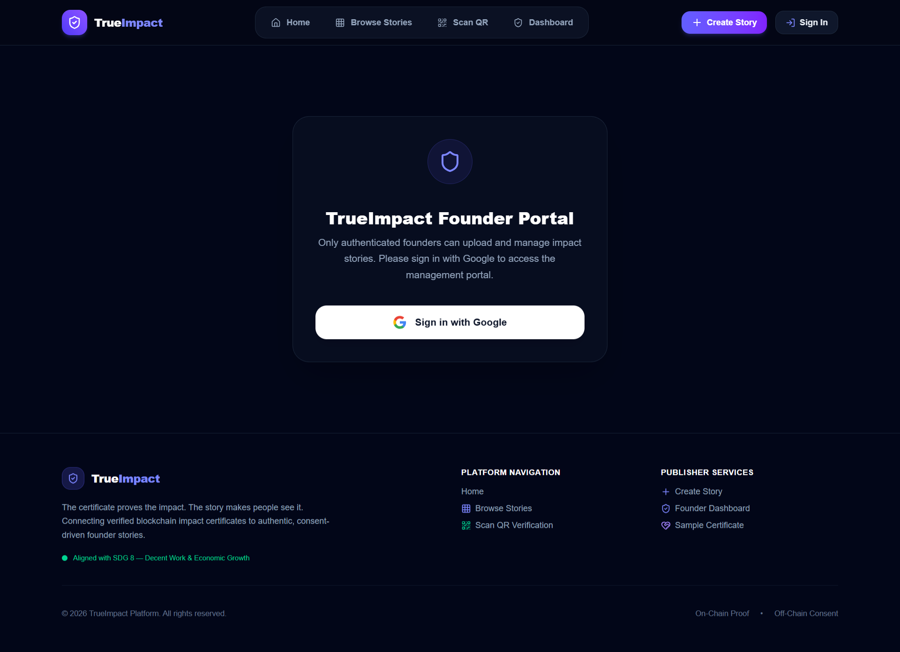

# TrueImpact — Bringing Human Voice & Stories to Verified Impact

> **"The Certificate Proves. The Story Moves."**  
> TrueImpact is a consent-driven, AI-powered platform that connects anonymized blockchain impact certificates with authentic, human-centered founder stories.

---

## 🏆 Hackathon Context

This project was created for the **AI Builder Hackathon** in **Addis Ababa, Ethiopia** (August 29–30, 2026).

* **Organizers**: [Hackation](https://hackation.de) (First international edition outside Germany)
* **Venue**: Magnolia Hotel & Conference Centre, Bole Atlas, Addis Ababa
* **Challenge Track**: *Build the Agent — Agentic AI for Real-World Operations*
* **Track Focus**: Workflow Automation & Open Innovation

---

## 💡 The Real-World Problem

When donors, NGOs, or global organizations fund local initiatives (such as expanding a garment workshop or funding youth employment in East Africa), the proof of work is often reduced to **cold, anonymized data**:

* **Cryptographic Hashes & Numbers**: "9 jobs created in Addis Ababa", "0x8a91a969...".
* **Lack of Human Connection**: Donors never get to hear the founder's real voice, experience the workshop's pride, or see the actual lives changed.
* **The Privacy & Consent Dilemma**: Forcing small business owners and local workers to permanently post their identities online exposes them to data abuse and privacy risks.

> **The Gap**: Donors feel disconnected from the human impact of their contributions, while local founders lack a simple, respectful way to share their story with supporters.

---

## ✨ How TrueImpact Fixes It

**TrueImpact** bridges the gap between **trusted proof** and **human emotion**. It enables local business owners to share their impact in their own words, while Agentic AI handles transcription, translation, and audio narration automatically.

```
┌───────────────────────────┐      ┌───────────────────────────┐      ┌───────────────────────────┐
│   1. Founder Voice Note   │ ───► │  2. Agentic AI Pipeline   │ ───► │ 3. Multi-Lingual Story    │
│  (Amharic & Afaan Oromo)  │      │ (STT + Direct Translation)│      │  (English & German Audio) │
└───────────────────────────┘      └───────────────────────────┘      └───────────────────────────┘
                                                                                    │
                                                                                    ▼
                                                                      ┌───────────────────────────┐
                                                                      │ 4. Verified Certificate   │
                                                                      │   + Direct Donor Contact  │
                                                                      └───────────────────────────┘
```

### 1. Voice-First & Multi-Lingual Input
A local founder simply records a brief voice note on their phone in their native language (**Amharic** or **Afaan Oromo**) and uploads a few photos of their workshop. No complex writing or English fluency required.

### 2. Automated Agentic AI Pipeline
* **Native Speech Recognition**: Converts local spoken audio into text.
* **Verbatim Translation**: Translates local speech directly into English and German while preserving the founder's original tone and meaning.
* **Natural Audio Narration**: Generates high-quality English and German voiceovers so global donors can listen in their native language.

### 3. Consent-Driven & Granular Visibility Controls
TrueImpact is built around **privacy by design** and **granular consent**:

* 🌐 **Public**: Story and media are fully accessible to anyone browsing the registry.
* 🔒 **Private**: Hidden from public view; accessible only by the logged-in founder.
* 👤 **Donor-Only (Protected)**: Designed for scenarios where an employee (or founder) appears in the uploaded media and prefers not to be publicly exposed on the open web. Setting a story to **Donor-Only** restricts access so donors can view the story through a donor email verification process.

> ℹ️ *Note: This platform is a hackathon demonstration prototype (demo).*

### 4. Direct Founder-Donor Connection
* Donors viewing a story can contact the founder directly via email to provide follow-up funding, equipment support, or mentorship.

---

## 📸 Application Screenshots

### 1. Platform Landing Page


### 2. Secure Founder Sign In


### 3. Voice Upload & Consent Configuration


### 4. AI Story Generation & Approval Draft


### 5. Founder Story Storage Dashboard


### 6. Public Impact Story Registry


### 7. Interactive Human Story View & Multi-Lingual Player


---

## 🛠️ Key Platform Features

* 🎙️ **Amharic & Afaan Oromo Voice Input**: Native speech processing tailored for local founders.
* 🌐 **Automated Multi-Lingual Voiceovers**: Instant English and German narration generation.
* 📱 **Interactive QR Certificates**: Connects cryptographic impact certificates to human stories via QR code scanning.
* 🔐 **Isolated Founder Dashboard**: Secure login via Google allowing founders to manage, review, or delete their published impact stories.
* 💌 **Direct Contact Portal**: Enables interested donors to reach out to founders directly for future contributions.
* 🔔 **Global Custom Notification System**: Styled glassmorphism confirmation modals for all story management actions.

---

## 👥 Hackathon Team & Contributors

Built with passion during the **AI Builder Hackathon 2026** in Addis Ababa:

| Contributor | GitHub Profile |
| :--- | :--- |
| **Habtemariam Chuchu** | [@d3fau1t11](https://github.com/d3fau1t11) |
| **Abdurahman** | [@ABDURE444](https://github.com/ABDURE444/) |
| **Ribka** | [@Ribka12](https://github.com/Ribka12) |
| **Lidia Asamnew** | [@lidiaAsamnew](https://github.com/lidiaAsamnew) |

---

## 🚀 Quick Start Guide

### 1. Clone the Repository
```bash
git clone https://github.com/d3fau1t11/TrueImpact.git
cd TrueImpact
```

### 2. Install Dependencies
```bash
npm install
```

### 3. Set Up Environment Variables
Create a `.env.local` file in the root directory:
```env
NEXT_PUBLIC_APP_URL=http://localhost:3000

# Supabase Credentials
NEXT_PUBLIC_SUPABASE_URL=your_supabase_url
NEXT_PUBLIC_SUPABASE_ANON_KEY=your_supabase_anon_key
SUPABASE_SERVICE_ROLE_KEY=your_supabase_service_role_key

# AI API Keys
ADDISAI_API_KEY=your_addisai_key
RAPIDAPI_CHATGPT_KEY=your_rapidapi_chatgpt_key
ELEVENLABS_API_KEY=your_elevenlabs_key
```

### 4. Run the Platform Locally
```bash
npm run dev
```
Open [http://localhost:3000](http://localhost:3000) in your browser.

---

## 🎯 Alignment & Impact

* **Challenge Track**: *Build the Agent — Agentic AI for Real-World Operations*
* **SDG Target**: **UN SDG 8 — Decent Work & Economic Growth**
* **Event**: [Hackation AI Builder Hackathon 2026](https://hackation.de), Addis Ababa, Ethiopia.
